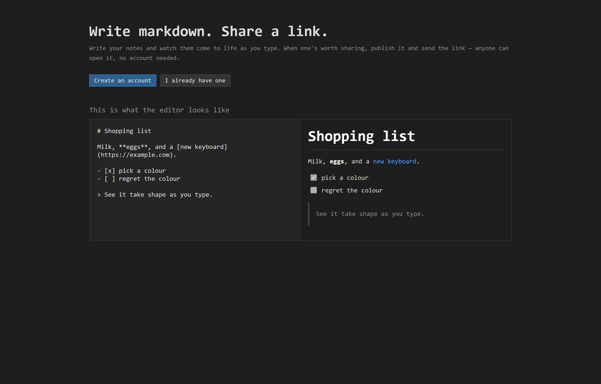
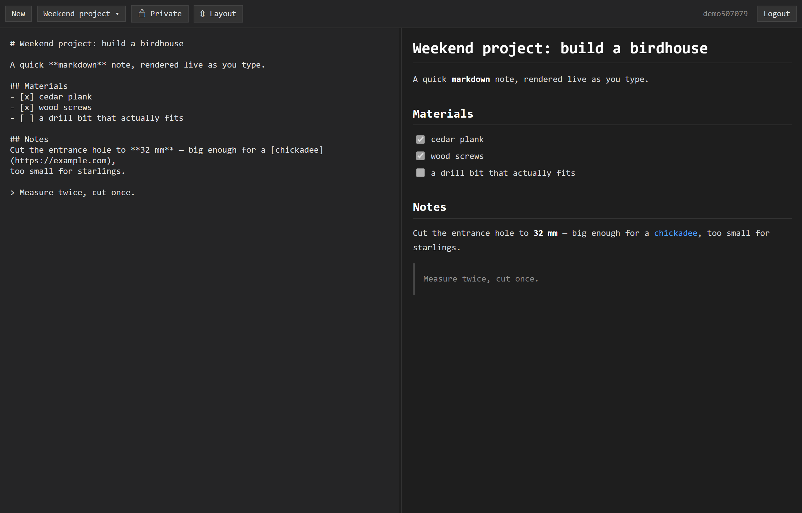
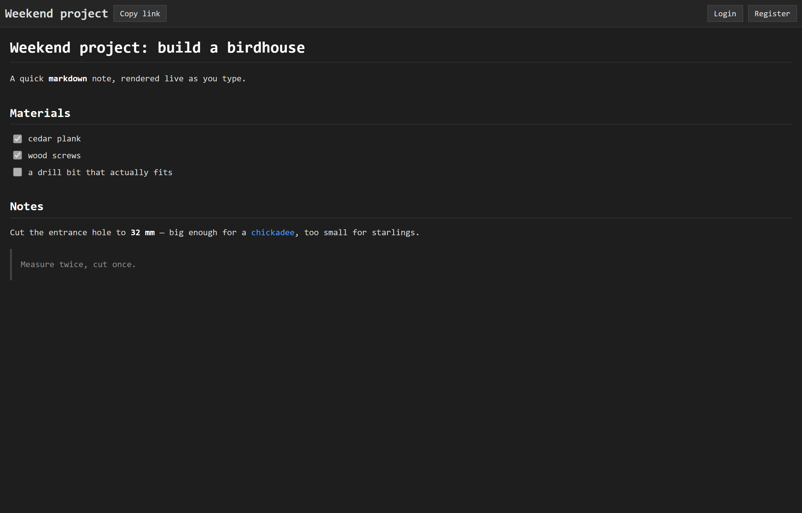

# Notes

A small, self-hostable **markdown notes app with public sharing**. Write notes in a split-pane editor that renders as you type, keep them private, and publish any note to get a public link that anyone can open, no account required.

Built with ASP.NET Core minimal APIs (.NET 9), EF Core + SQLite, and a plain HTML/CSS/JS frontend with no build step.

## Screenshots

**Landing page**



**Editor: live markdown preview with autosave**



**Shared note: public, read-only, no account needed**



## Features

- **Accounts**: register / login with a cookie session.
- **Live editor**: split-pane markdown editor with a live, server-rendered preview and debounced autosave. Drag the gutter or flip the layout between side-by-side and stacked.
- **Sharing**: notes are private by default; publish one to mint a stable `/{slug}` link. A note keeps its slug, so unpublishing and re-publishing revives the same link.
- **Public viewer**: shared notes render read-only.
- **Safe rendering**: markdown is rendered and **sanitized on the server** before it reaches any browser.

## Tech stack

| Concern | Choice |
|---|---|
| Web framework | ASP.NET Core minimal APIs (.NET 9) |
| Database | SQLite via EF Core 9 |
| Auth | Cookie authentication |
| Password hashing | PBKDF2 (SHA-256, 100k iterations) + server-side pepper |
| Markdown | [Markdig](https://github.com/xoofx/markdig) to HTML, sanitized with [HtmlSanitizer](https://github.com/mganss/HtmlSanitizer) |
| Frontend | Static HTML/CSS/JS in `wwwroot` (no bundler) |

## Getting started

**Prerequisites:** the [.NET 9 SDK](https://dotnet.microsoft.com/download).

```bash
cd Notes          # the project directory (repo-root/Notes)
dotnet run
```

The app starts on **http://localhost:5142** (see `Properties/launchSettings.json`). It creates and migrates a `notes.db` SQLite file next to the app on first run.

## Configuration

| Variable | Purpose | Default |
|---|---|---|
| `NOTES_PEPPER` | Secret mixed into every password hash. **Required in Release**; in Debug it falls back to a fixed dev value. | `NOTES_DEBUG` (Debug only) |
| `ConnectionStrings__Notes` | SQLite connection string. | `Data Source=notes.db` |

```bash
# Example: production run against an explicit database and pepper
NOTES_PEPPER='<long-random-secret>' \
ConnectionStrings__Notes='Data Source=/var/lib/notes/notes.db' \
dotnet run -c Release
```

> The pepper is a single long-lived secret kept **outside** the database. Changing it invalidates
> every existing password, so set it once and keep it stable.

## Database & migrations

The schema is managed with **EF Core migrations**, applied automatically at startup (`db.Database.Migrate()` in `Program.cs`). A design-time factory lets the CLI construct the context without booting the web host, and it honors `ConnectionStrings__Notes` so you can point tooling at a throwaway database.

```bash
cd Notes
dotnet ef migrations add <Name> -o Database/Migrations   # add a migration
dotnet ef database update                                 # apply pending migrations
```
